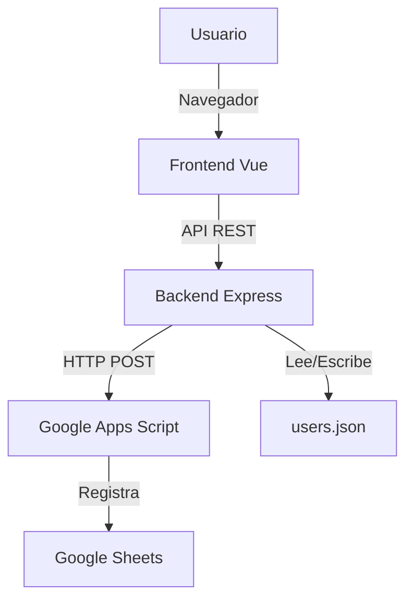
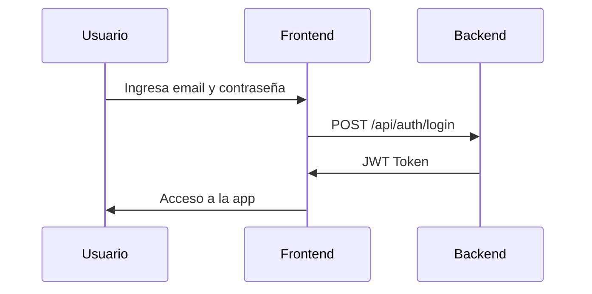
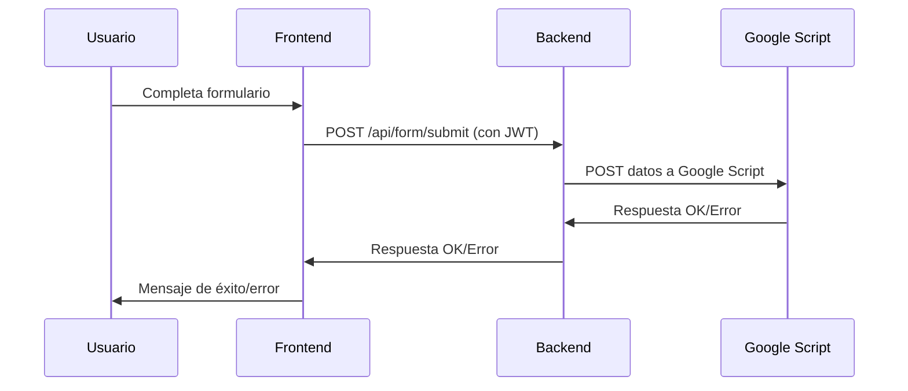

# Sistema de Gestión de Vacunas Negra Hipólita

Este proyecto es una aplicación web compuesta por un **Frontend** (Vue 3 + Vite + TailwindCSS) y un **Backend** (Node.js + Express), diseñada para la gestión y registro de vacunas.

---

## Tabla de Contenidos

- [Descripción General](#descripción-general)
- [Arquitectura](#arquitectura)
- [Diagramas](#diagramas)
- [Instalación y Uso](#instalación-y-uso)
  - [Backend](#backend)
  - [Frontend](#frontend)
- [Variables de Entorno](#variables-de-entorno)
- [Licencia](#licencia)

---

## Descripción General

El sistema permite:
- Autenticación de usuarios mediante JWT.
- Registro seguro de formularios de vacunación.
- Integración con Google Sheets vía Google Apps Script.
- Interfaz moderna y responsiva.

---

## Arquitectura

```
┌────────────┐      HTTP/API      ┌──────────────┐      HTTP/REST      ┌────────────────────┐
│  Frontend  │  <──────────────>  │   Backend    │  <──────────────>   │ Google Apps Script │
│   (Vue)    │                    │ (Node/Express)│                   │   (Google Sheets)  │
└────────────┘                    └──────────────┘                     └────────────────────┘
```

---

## Diagramas

### 1. Diagrama General



### 2. Flujo de Autenticación



### 3. Flujo de Envío de Formulario



---

## Instalación y Uso

### Backend

1. **Requisitos:** Node.js >= 16, npm
2. **Instalación:**
    ```sh
    cd Backend
    npm install
    ```
3. **Configura el archivo `.env`:**
    ```
    PORT=3000
    JWT_SECRET=tu_clave_secreta
    MASTER_KEY=clave_maestra_para_crear_usuarios
    DEFAULT_ADMIN_EMAIL=tu_admin@email.com
    DEFAULT_ADMIN_PASSWORD=una_contraseña_segura
    GOOGLE_SCRIPT_URL=tu_google_script_url
    ```
4. **Ejecuta el servidor:**
    ```sh
    npm start
    ```

### Frontend

1. **Requisitos:** Node.js >= 16, npm
2. **Instalación:**
    ```sh
    cd Frontend
    npm install
    ```
3. **Configura el archivo `.env`:**
    ```
    VITE_API_LOGIN_URL=tu_api_login_url
    VITE_API_SUBMIT_URL=tu_api_submit_url
    ```
4. **Modo desarrollo:**
    ```sh
    npm run dev
    ```
5. **Build para producción:**
    ```sh
    npm run build
    ```

---

## Variables de Entorno

### Backend (`Backend/.env`)
- `PORT`: Puerto del servidor backend.
- `JWT_SECRET`: Clave secreta para JWT.
- `MASTER_KEY`: Clave maestra para crear usuarios.
- `DEFAULT_ADMIN_EMAIL`: Email del admin por defecto.
- `DEFAULT_ADMIN_PASSWORD`: Contraseña del admin por defecto.
- `GOOGLE_SCRIPT_URL`: URL del Google Apps Script.

### Frontend (`Frontend/.env`)
- `VITE_API_LOGIN_URL`: Endpoint de login del backend.
- `VITE_API_SUBMIT_URL`: Endpoint de envío de formulario.

---

## Licencia

------

---

### Gracias Github Copilot por el Readme.md
